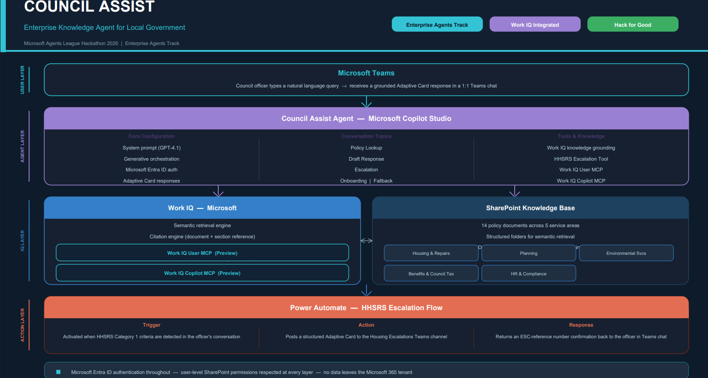
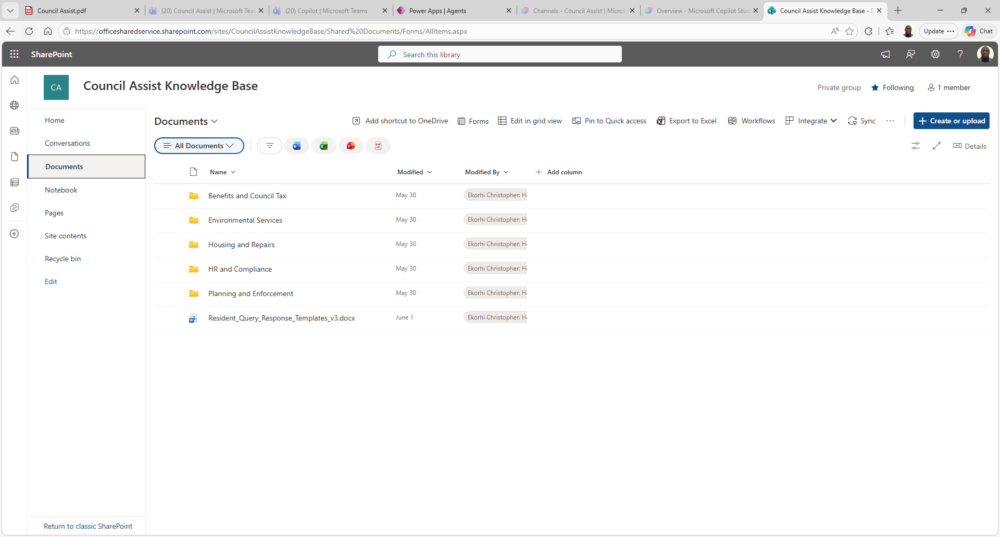

# 🏛️ Council Assist
### Enterprise Knowledge Agent for Local Government

**Microsoft Agents League Hackathon 2026 | Enterprise Agents Track**

---

## 🎬 Demo Video

> **[▶ Watch Council Assist in Action](https://youtu.be/7SDfDnO9gNU)**

---

## What It Does

Council Assist is an AI-powered knowledge agent built for local government officers using Microsoft Copilot Studio. It lives inside Microsoft Teams and helps officers instantly retrieve council policies, draft responses, and escalate high-risk cases — all from a single natural language message.

Officers type a question in plain English. Council Assist retrieves the correct policy from the council's SharePoint knowledge base, cites the exact document and version, and — when a vulnerable resident is involved — autonomously raises an HHSRS escalation and posts an Adaptive Card to the Housing Escalations Teams channel.

---

## The Problem

Council officers spend an average of 30 minutes every day searching for policies, drafting responses, and trying to find the right procedure for the right situation. In a team of 50, that is 750 hours per week lost to administration — time that should go to residents.

---

## Architecture

| Layer | Component | Purpose |
|---|---|---|
| User | Microsoft Teams | Officer interaction via 1:1 chat |
| Agent | Microsoft Copilot Studio | Generative orchestration + GPT-4.1 |
| IQ | Work IQ + SharePoint | Semantic retrieval + citation engine |
| IQ | Work IQ User MCP | Microsoft 365 organisational context |
| IQ | Work IQ Copilot MCP | Copilot Search across M365 tenant |
| Action | Power Automate | HHSRS escalation workflow |
| Security | Microsoft Entra ID | Authentication + permission-aware access |

---

## Microsoft IQ Integration

Work IQ is the core intelligence layer — not a toggle, but the architectural foundation of every response.

- **Semantic retrieval** pulls answers from the council's SharePoint knowledge base
- **Citation engine** returns the exact document name and version with every response
- **Metadata date filtering** ensures responses reference the most current policy version
- **Permission-aware access** — users only see documents they already have rights to
- **Work IQ User MCP** connected as a tool for Microsoft 365 organisational context
- **Work IQ Copilot MCP** connected as a tool for Copilot Search across the tenant

---

## Knowledge Base

14 synthetic policy documents across 5 service areas, created for demonstration purposes using fictional **Westbridge Council** as the scenario organisation.

| Service Area | Documents |
|---|---|
| Housing & Repairs | Disrepair Complaint Procedure v4, Void Property Inspection Policy v3, Housing Allocations Policy v2, Damp and Mould Response Policy v1 |
| Planning & Enforcement | Planning Application Guidance v5, Planning Enforcement Policy v3 |
| Environmental Services | Noise Complaint Procedure v4, Bulky Waste Collection Policy v2 |
| Benefits & Council Tax | Housing Benefit Assessment Guide v6, Council Tax Reduction Guidance v3 |
| HR & Compliance | Grievance Policy v5, Flexible Working Policy v4, Sickness Absence Policy v6, Resident Query Templates v3 |

---

## Tech Stack

- Microsoft Copilot Studio
- Microsoft Work IQ (User MCP + Copilot MCP)
- SharePoint Online
- Power Automate
- Microsoft Teams
- Microsoft Entra ID

---

## How to Deploy

### Prerequisites
- Microsoft 365 tenant
- Copilot Studio access (free trial at aka.ms/TryCopilotStudio)
- SharePoint Online site
- Power Automate access

### Step 1 — Set Up SharePoint
1. Create a SharePoint Communication Site
2. Create folders: Housing and Repairs, Planning and Enforcement, Environmental Services, Benefits and Council Tax, HR and Compliance
3. Upload your council policy documents to the relevant folders
4. Wait for indexing to complete (status shows Ready in Copilot Studio)

### Step 2 — Create the Agent
1. Go to copilotstudio.microsoft.com
2. Click Create → New agent → Skip to configure
3. Set the agent name, description, and paste the system prompt from `copilot-studio/agent-instructions.md`
4. Set Authentication to Authenticate with Microsoft

### Step 3 — Add Knowledge Source
1. Click Add knowledge → SharePoint
2. Paste your SharePoint site URL
3. Add the knowledge description from `copilot-studio/agent-instructions.md`
4. Wait for Ready status

### Step 4 — Add Work IQ MCP Tools
1. Go to Settings → Connections
2. Connect Work IQ User MCP
3. Connect Work IQ Copilot MCP
4. Add both as tools to the agent

### Step 5 — Add Power Automate Escalation Flow
1. Build the HHSRS Escalation Flow following `power-automate/hhsrs-escalation-flow.md`
2. Add it as a tool to the agent

### Step 6 — Deploy to Teams
1. Publish the agent
2. Go to Channels → Teams and Microsoft 365 Copilot → Add channel
3. Click See agent in Teams → Add

---

## Social Impact

Council Assist serves the residents who depend on council services for housing, benefits, social care, and planning. Faster, more accurate officer responses mean vulnerable residents receive correct guidance sooner, and housing hazards are escalated before they cause harm.

---

## Developer

**Christopher Ekorhi** — Power Platform Developer  
Microsoft Agents League Hackathon 2026 | Enterprise Agents Track

---

## Disclaimer

All policy documents are synthetic and created for demonstration purposes only. Westbridge Council is a fictional organisation. No real council data, resident data, or personally identifiable information has been used. See [DISCLAIMER.md](DISCLAIMER.md) for full details.
