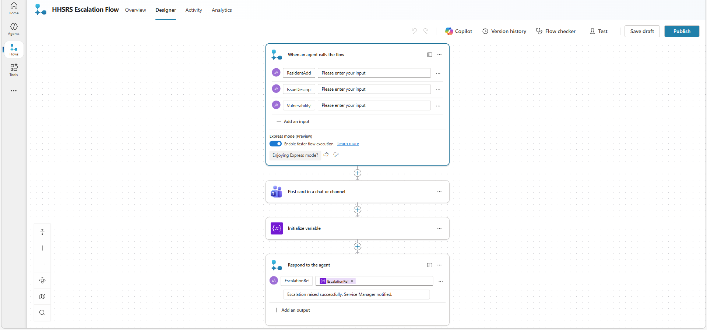

# HHSRS Escalation Flow

## Flow Screenshot

This Power Automate agent flow is triggered by Council Assist when HHSRS Category 1 hazard criteria are detected in an officer's conversation.

---

## Flow Type

Agent Flow — built in Copilot Studio via Flows → New flow → Agent flow.

---

## Trigger — When an agent calls the flow

### Inputs

| Name | Type |
|---|---|
| ResidentAddress | Text |
| IssueDescription | Text |
| VulnerabilityIndicator | Text |

---

## Actions

### 1. Post card in a chat or channel (Microsoft Teams)

| Setting | Value |
|---|---|
| Post as | Flow bot |
| Post in | Channel |
| Team | Your team |
| Channel | Housing Escalations |

The Adaptive Card displays the property address, issue reported, vulnerability indicator, P1 priority level, and required actions under Awaab's Law.

### 2. Initialize variable — Escalation Reference

| Setting | Value |
|---|---|
| Name | EscalationRef |
| Type | String |
| Value | `ESC-@{formatDateTime(utcNow(),'yyyyMMdd-HHmm')}` |

### 3. Respond to the agent

| Output | Type | Value |
|---|---|---|
| EscalationReference | Text | EscalationRef variable |
| EscalationStatus | Text | Escalation raised. Housing team notified via Teams. |

---

## Important Settings

- Asynchronous response must be set to **Off**
- Express mode — leave **On**

---

## Tool Configuration in Copilot Studio

After publishing the flow, add it to the agent as a tool:

| Setting | Value |
|---|---|
| Name | HHSRS Escalation Tool |
| Fill using | Dynamically fill with AI |
| After running | Respond with AI |

Paste the tool description from `copilot-studio/agent-instructions.md` into the tool description field.
